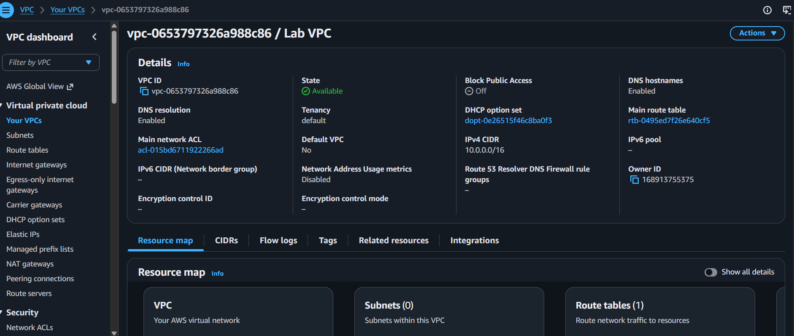
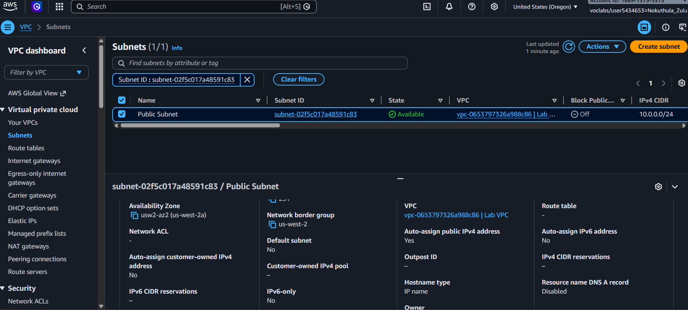
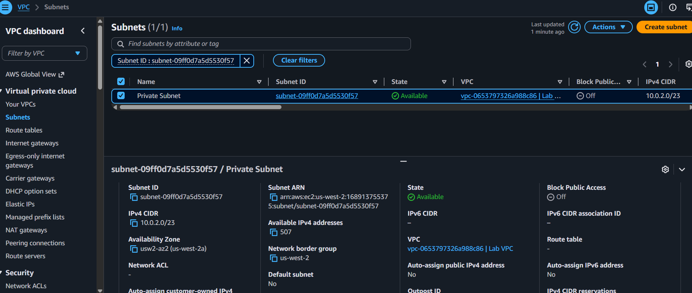
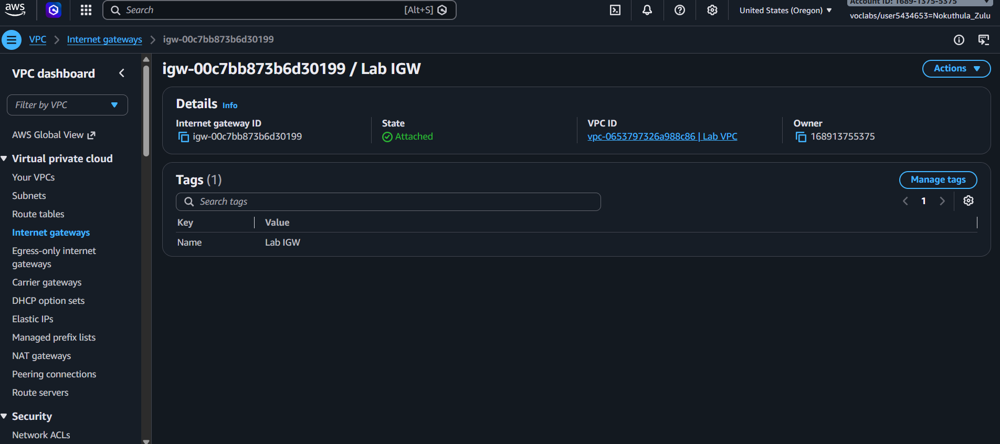
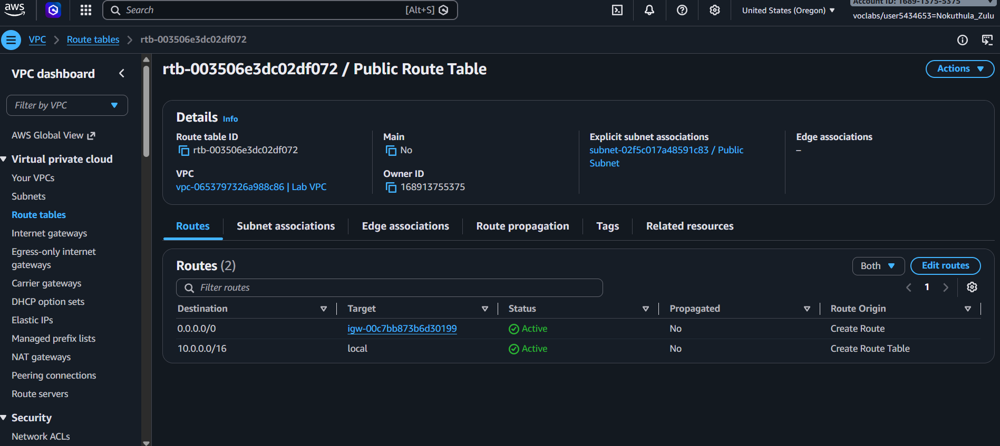
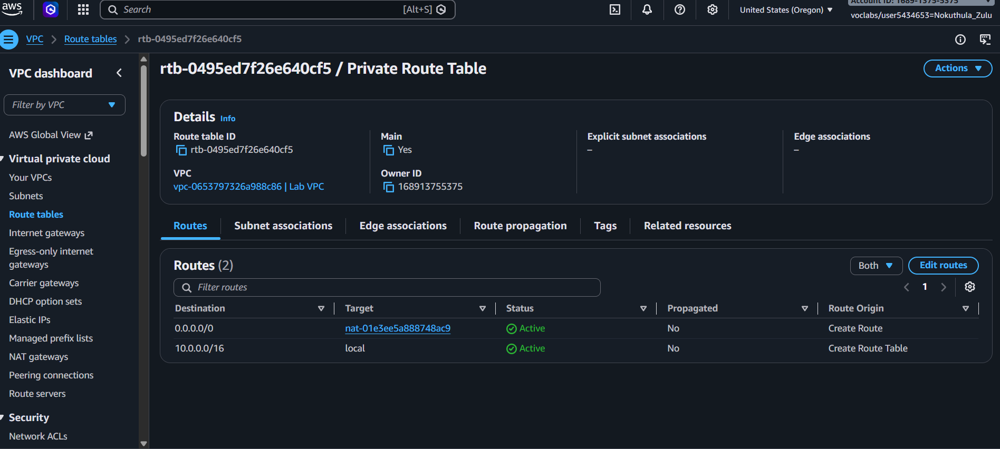
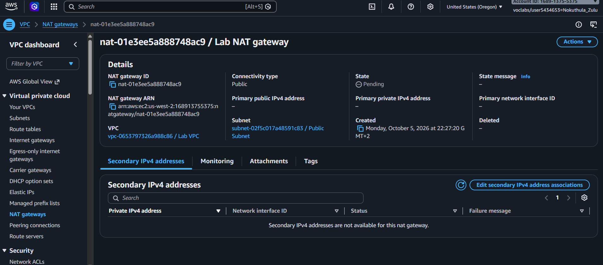
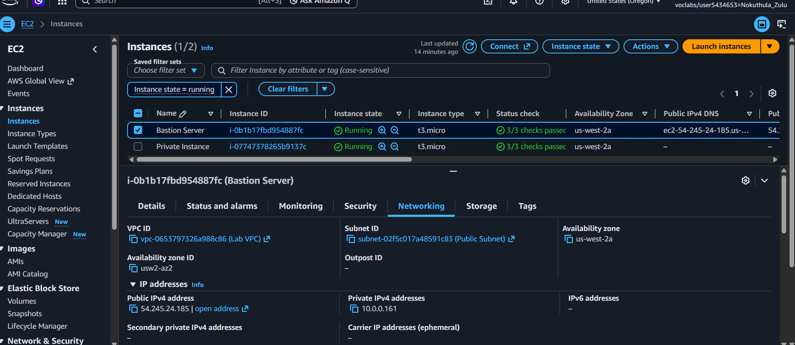
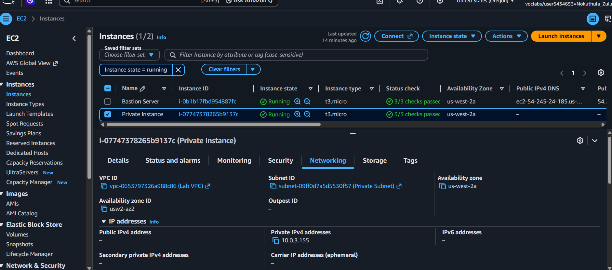

# AWS VPC Networking Project

## 📌 Project Overview

This project demonstrates the design and implementation of a **custom Amazon VPC network architecture** using AWS networking and compute services.

The environment was configured with **public and private subnets**, Internet Gateway, NAT Gateway, route tables, and EC2 instances. A **Bastion Host** was deployed in the public subnet to provide controlled access to an EC2 instance in the private subnet.

The project demonstrates practical knowledge of **AWS networking, subnet segmentation, routing, private resource access, and outbound internet connectivity**.

---

## 🏗️ Architecture

The architecture consists of:

* Amazon VPC
* Public Subnet
* Private Subnet
* Internet Gateway (IGW)
* NAT Gateway
* Public Route Table
* Private Route Table
* Bastion Server
* Private EC2 Instance

### Network Design

```text
                         Internet
                            │
                            │
                    ┌───────▼───────┐
                    │ Internet      │
                    │ Gateway (IGW) │
                    └───────┬───────┘
                            │
                ┌───────────▼───────────┐
                │       AWS VPC         │
                │      10.0.0.0/16      │
                │                       │
                │  ┌─────────────────┐  │
                │  │  Public Subnet  │  │
                │  │   10.0.0.0/24   │  │
                │  │                 │  │
                │  │ Bastion Server   │  │
                │  │                 │  │
                │  │   NAT Gateway    │  │
                │  └────────┬────────┘  │
                │           │            │
                │           │ NAT        │
                │           ▼            │
                │  ┌─────────────────┐  │
                │  │ Private Subnet  │  │
                │  │   10.0.2.0/23   │  │
                │  │                 │  │
                │  │ Private EC2      │  │
                │  └─────────────────┘  │
                │                       │
                └───────────────────────┘
```

---

## ☁️ AWS Services Used

| AWS Service          | Purpose                                                 |
| -------------------- | ------------------------------------------------------- |
| **Amazon VPC**       | Created the isolated virtual network                    |
| **Amazon EC2**       | Hosted the Bastion Server and private instance          |
| **Internet Gateway** | Provided internet connectivity for the public subnet    |
| **NAT Gateway**      | Allowed private-subnet resources to access the internet |
| **Route Tables**     | Controlled traffic routing between network components   |
| **Subnets**          | Separated public and private resources                  |

---

## 🌐 Network Configuration

### VPC

Created a custom VPC with:

```text
VPC CIDR: 10.0.0.0/16
```

DNS hostnames were enabled for the VPC.

### Public Subnet

```text
Name: Public Subnet
CIDR: 10.0.0.0/24
```

The public subnet was configured with a route to the Internet Gateway.

### Private Subnet

```text
Name: Private Subnet
CIDR: 10.0.2.0/23
```

The private subnet was designed to keep resources isolated from direct internet access.

---

## 🔀 Routing Configuration

### Public Route Table

The public route table was associated with the public subnet and configured with:

```text
Destination: 0.0.0.0/0
Target: Internet Gateway
```

This allows resources in the public subnet to communicate with the internet.

### Private Route Table

The private route table was associated with the private subnet and configured with:

```text
Destination: 0.0.0.0/0
Target: NAT Gateway
```

This allows resources in the private subnet to initiate outbound internet connections without requiring direct public internet access.

---

## 🔐 Bastion Host

An EC2 instance named **Bastion Server** was deployed in the public subnet.

The Bastion Host provides an access point for connecting to resources located inside the private subnet.

The connectivity flow was:

```text
Client
   │
   ▼
Bastion Server
(Public Subnet)
   │
   ▼
Private EC2
(Private Subnet)
```

---

## 🖥️ Private EC2 Instance

An EC2 instance was deployed inside the private subnet.

The instance did not have direct public internet accessibility.

Access was performed through the Bastion Server, demonstrating the concept of accessing private resources through a public jump host.

---

## 🌍 NAT Gateway Testing

After connecting to the private instance through the Bastion Server, outbound internet connectivity was tested using:

```bash
ping -c 3 amazon.com
```

Successful responses confirmed that the private instance could communicate with the internet through the configured NAT Gateway.

---

## 📸 Project Screenshots

### VPC



### Public and Private Subnets





### Internet Gateway



### Route Tables





### NAT Gateway



### Bastion Server



### Private EC2 Instance



### Bastion to Private Instance Connection


### NAT Gateway Connectivity Test


---

## 🧠 Key Skills Demonstrated

* AWS VPC networking
* IPv4 CIDR addressing
* Public and private subnet design
* Network segmentation
* Route table configuration
* Internet Gateway configuration
* NAT Gateway configuration
* EC2 networking
* Bastion Host / jump server architecture
* Private resource connectivity
* Linux command-line networking
* AWS infrastructure troubleshooting

---

## 🎯 Project Outcomes

Through this project, I gained hands-on experience with designing and configuring an AWS network environment and understanding how different networking components work together.

The project demonstrates how to:

1. Create an isolated AWS VPC.
2. Divide the network into public and private subnets.
3. Configure routing for public resources.
4. Provide outbound internet access to private resources using a NAT Gateway.
5. Deploy a Bastion Host for access to private resources.
6. Test connectivity from a private EC2 instance.

---

## 🚀 Future Improvements

Potential improvements to this architecture include:

* Deploying resources across multiple Availability Zones.
* Implementing more restrictive security-group rules.
* Using AWS Systems Manager Session Manager instead of a Bastion Host.
* Provisioning the infrastructure using **Terraform**.
* Adding network monitoring and logging.
* Implementing VPC Flow Logs.
* Automating infrastructure deployment through a CI/CD pipeline.

---

## 🛠️ Technologies

**AWS | Amazon VPC | EC2 | Internet Gateway | NAT Gateway | Route Tables | Linux | Networking | Cloud Infrastructure**

---

## 👩🏽‍💻 Author

**Nokuthula Patience Zulu**

Cloud / DevOps Engineering Portfolio

GitHub: [Nok2lapatience](https://github.com/Nok2lapatience)
